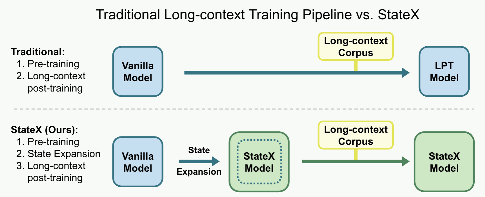

# StateX: Enhancing RNN Recall via Post-training State Expansion



This is the official implementation of the paper [StateX: Enhancing RNN Recall via Post-training State Expansion](https://arxiv.org/abs/2509.22630). Run the scripts to reproduce the results in the paper.

## Requirements

`pip install -r requirements.txt` and 8 GPUs with at least 80GB memory each.

Download the required pretrained models (GLA-1.3B, Mamba2-1.3B) by running

```bash
cd huggingface
python download.py
```

You should download the dataset `AlppAI/SlimPajama-chunked` (<https://huggingface.co/datasets/AlppAI/SlimPajama-chunked>) to the directory `/home/data/slimpj-chunked` or modify the `data_path` in `data/slimpj.py` and `configs/training/drop/10b_bsz-512k_64k_cos_3e-4_slimpj.json`.

## Training

The checkpoints and logs will be saved in `./output/{proj_name}/{model_name}/{run_name}`. The `args.json` and `model_config.json` files are saved in the same folder. The checkpoint will be saved in `ckpt_{step}` folder in safetensors format. You can use safetensors to load the model.

### Main Experiments

To train a 1.3B model with StateX, run `bash scripts/gla_StateX.sh` and `bash scripts/mamba2_StateX.sh`. To train the LPT version, run `bash scripts/gla_LPT.sh` and `bash scripts/mamba2_LPT.sh`.

### Ablation Studies

#### Best Proportion of Expanded Layers

To change the proportion of expanded layers, modify the `drop_prop` argument in `scripts/{gla,mamba2}_StateX.sh` and then run the script. The `drop_prop` represents the interval of layers to be expanded. For example, `drop_prop=6` means expanding 1 layer in every 6 layers. The `drop_prop` should be an factor of the total number of layers.

#### Comparison Between Reinitialization and Parameter Inheritance

To compare the two methods, modify the `drop_mode` argument in `scripts/{gla,mamba2}_StateX.sh` and then run the script.

1. For GLA, set the `drop_mode` argument to `merge` in `scripts/gla_StateX.sh` and then run the script.
2. For Mamba2, set the `drop_mode` argument to `merge_copy` in `scripts/mamba2_StateX.sh` and then run the script.

# How to Cite?

```bibtex
@misc{
  title={StateX: Enhancing RNN Recall via Post-training State Expansion},
  authors={Xingyu Shen and Yingfa Chen and Zhen Leng Thai and Xu Han and Zhiyuan Liu and Maosong Sun},
  year={2025},
  url={https://arxiv.org/abs/2509.22630},
}
```
